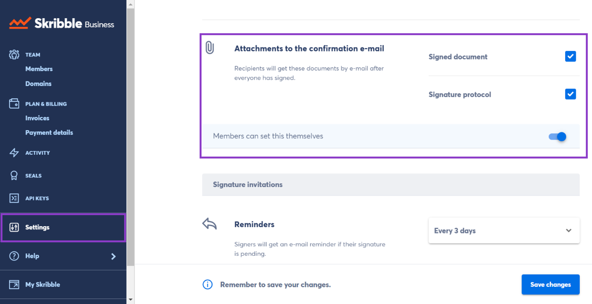
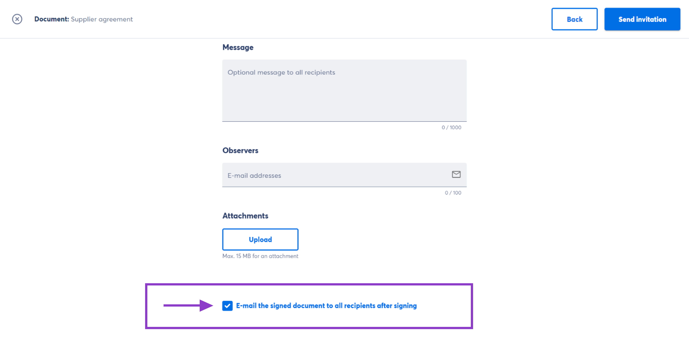

.. _account-attachments:

==================================
Confirmation E-Mail Attachments 🆕
==================================

After all invited parties have signed a document, they receive a final confirmation e-mail. This e-mail contains a link to the signed document. As an admin, you can set if any of the following documents should also be attached: 

•	**Signed document**
•	**Signature protocol** (for Enterprise customers)

.. NOTE::
   You can also let your members decide if they want to attach these documents or not. If you do so, they can say yes or no, but they can't choose which documents to attach.

Here is how it works:

- Click **Settings** on the right in your `Admin area`_

.. _Admin area: https://my.skribble.com/business/settings

    

- Then navigate to **Attachments to the confirmation e-mail**

- Now **Select the documents** that should be attached to the e-mail

   •	Signed document
   •	Signature protocol (for Enterprise customers) 
   •	Both signed document and signature protocol

- If you also activate the switch below the documents, your members will be able to decide if they want to attach them when setting up a signature invitation

What your members see
---------------------

- Your members can uncheck the preselected checkbox they see **only** if you activate the switch

  
  
- Here are a few examples of how it works

      •	**Example 1:** Let's say you select both the signed document and signature protocol in your admin settings and slide the switch to the right to let your members decide. In this case, your members can uncheck the checkbox if they don't want to attach these documents to the e-mail.

      
      •	**Example 2:** Let's say you select only the signed document and don't slide the switch to the right. In this case, the signed document will be attached to the e-mail. Your members won't be able to change this as they won't see the preselected checkbox.
      
