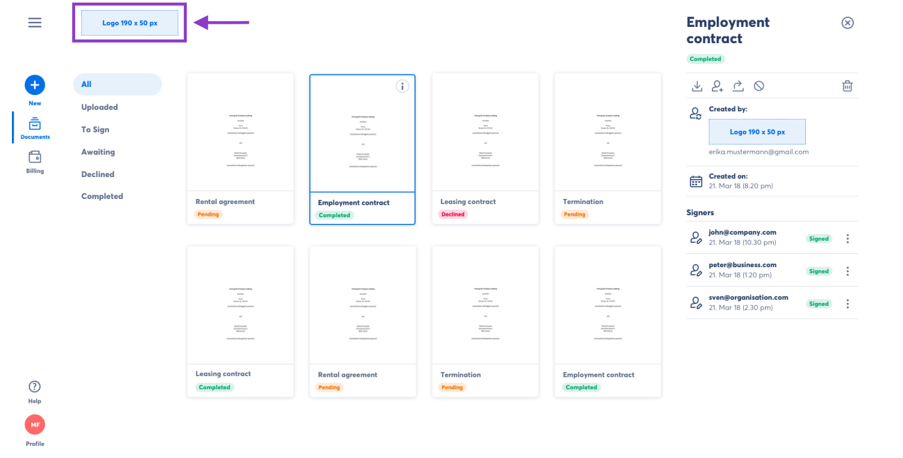
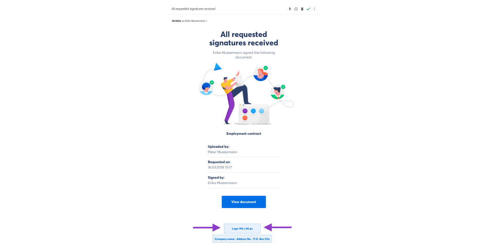
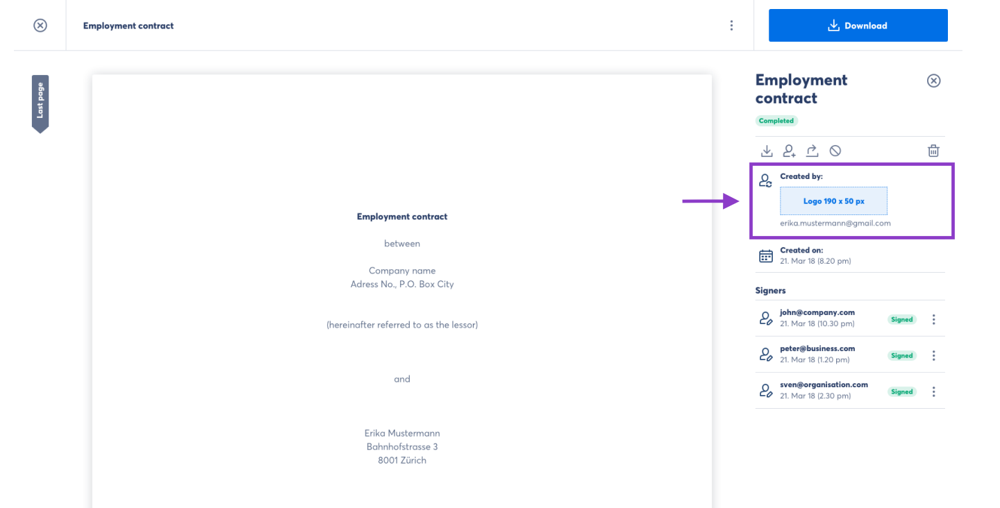

.. _account-branding:

=======================
Adding Company Branding
=======================

.. NOTE::
  To request company branding, please contact our team at support@skribble.com. We'll be happy to assist you.

Skribble Business and Enterprise customers can customise their account with the company logo and address. This is a great way to convey trust and reliability to both your employees and customers. It also helps them recognise signing invitations that come from your company. For more information, see our `Pricing page`_.

.. _Pricing page: https://www.skribble.com/en/pricing/

Company branding will be displayed:
  - in the header (top-left) of members' account
  - in e-mail notifications and
  - in the sidebar of a document

Below you will find examples of company branding.

- **Account header**

Your company logo will be displayed in the header of the members' account. It replaces the logo of Skribble that we show by default.

    
    
- **E-Mail notifications**

When your employees invite someone to sign with Skribble, the person invited will receive a signing invitation by e-mail. Your company logo will be displayed in the footer of the e-mail along with the company address.

    

- **Document sidebar**

Your company logo will appear in the sidebar of a document when a person invited to sign opens a document.

    
