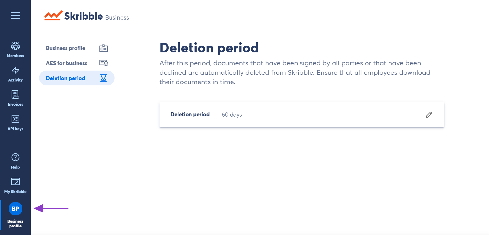
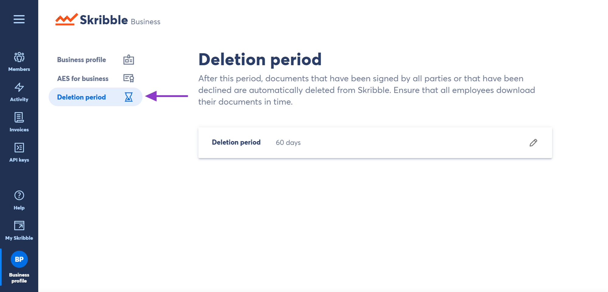
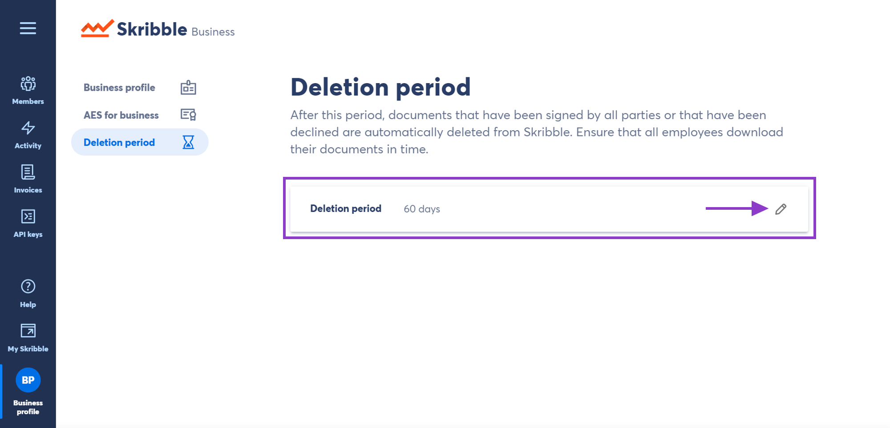
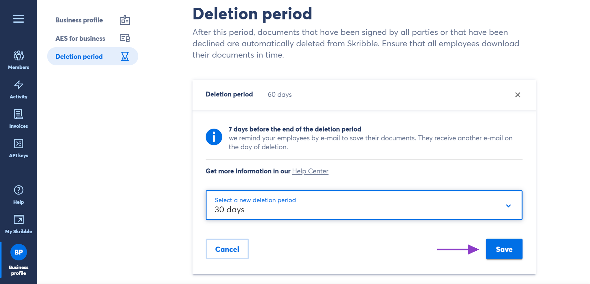

.. _account-deletionperiod:

==================================
Setting a Document Deletion Period
==================================

.. NOTE::
   This feature is only available to Skribble Enterprise customers.

As a Skribble Business admin, you can select a uniform document deletion period for all employees. After this period, their documents will be automatically deleted from Skribble.

You can select a document deletion period for:

•	**all documents regardless of their state** (only available to Enterprise customers who became customers after 17 February 2020)

•	**completed and declined documents** (documents that have been signed by all parties or declined by at least one person)

To select a document deletion period:

- Click **Business profile** if you're not already there

    
    
- Go to **Deletion period**

    

- Click the **pen icon** on the right and select the new deletion period from the drop-down menu

You'll be able to choose between 5, 10, 30, 60 and 90 days.

    
    
- Click **Save** to confirm

We recommend informing all employees about the new deletion period selected. They may need to download their documents before they're deleted from Skribble.

    
    
- **E-mail reminders to download affected documents**

We'll send an e-mail reminder to the affected employees one week before the document is deleted. They'll receive another e-mail on the day of deletion. If the document deletion period is set to **5 days**, they'll only receive one e-mail on the day of deletion.

Got a question or need a hand? Drop us an e-mail at `support@skribble.com`_. We'll be happy to help you.
   
   .. _support@skribble.com: support@skribble.com
