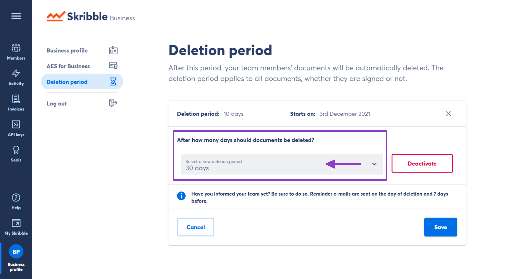

.. _account-deletionperiod:

=====================================
Setting a Document Deletion Period 🆕
=====================================

As an admin, you can set a deletion period for your team members’ documents on Skribble. After this period, their documents will be automatically deleted. The count starts on the day a document is uploaded to Skribble.

Depending on whether your company signs with Skribble or is about to switch to our e-signature solution, the deletion period applies to one of the below cases:

•	**all documents**, no matter whether signed or not → existing and new Business and Enterprise customers
•	**completed documents only** (signed, declined or withdrawn) → selected Enterprise customers (:ref:`Learn more<completed-documents>`)

**How do I know which documents are affected in my company?**
Check the description in your `Business profile`_. It tells whether all documents or only completed ones are affected.

.. _Business profile: https://my.skribble.com/business/profile/deletion-period

**In this article, you'll also learn:**

•	how to :ref:`activate the deletion period<activating-deletion-period>` for your team
•	what happens to :ref:`pending signatures<pending-signatures>`
•	what :ref:`e-mail reminders<e-mail-reminders>` your team members will get

**Tip!** Before you activate the deletion period for your team members, be sure to:

•	Inform them about the deletion period you're about to set.
•	Remind them to download the affected documents if they need them.

.. _activating-deletion-period:

**Activating deletion period**

.. NOTE::
   The activation of the deletion period will take 7 days. Be sure to remind your team members to download the affected documents before they're deleted.

- Click **Business profile** in the lower left
    
- Go to **Deletion period**

- Click **Activate deletion period**

- Select the desired number of days

- Click **Activate** to confirm

  .. image:: deletion-period-start-date.png
    :class: with-shadow
    

**Changing deletion period**

From your Business profile:

- Go to **Deletion period**
    
- Click on the **Pen symbol**

- Choose a new deletion period

- Click **Save** to confirm
   
   

    

**Shortening deletion period**
 
If you shorten your current deletion period, your team members might only get one e-mail reminder on the day of deletion. This will be the case for documents that have been on Skribble longer than the new deletion period set.

**Good to know**
   
.. _pending-signatures:

• **What happens to the pending signatures if a document gets deleted?**

Let's say the deletion period expires before all recipients have signed the document. In that case, pending signature invitations will be automatically cancelled. `Learn more`_

.. _Learn more: https://help.skribble.com/de/en/invitation-cancelled

.. _e-mail-reminders:
   
• **E-mail reminders for your team members**

We usually remind your team members that their documents are about to be deleted:

• **7 days before the deletion**
• **on the day of deletion**

**Hint!** Let's say you set the deletion period to 5 days or choose a shorter deletion period than your current one. In that case, your team members might only receive one e-mail reminder on the day of deletion. This will be the case for documents that have been on Skribble longer than the new deletion period.

**Questions or need a hand?** Write us a message at `support@skribble.com`_. We'll be happy to help.
   
   .. _support@skribble.com: support@skribble.com

**********************   **********************   **********************

.. NOTE::
   The information below only applies to Enterprise customers who haven’t activated the deletion period for all documents.
   
**Deletion period for completed documents**

.. _completed-documents:

If you haven't activated the deletion period for all documents, it only applies to completed (signed, declined or withdrawn) documents.

Would you like to switch to the deletion period for all documents? Write us a message at support@skribble.com.

**Setting deletion period**

You can set a deletion period that fits your company needs in a few easy steps. From your Business profile:

- Go to **Deletion period**
- Click on the **Pen symbol**
- Choose a new deletion period
- Click **Save** to confirm

It may take a few minutes until the new deletion period shows in your profile.
