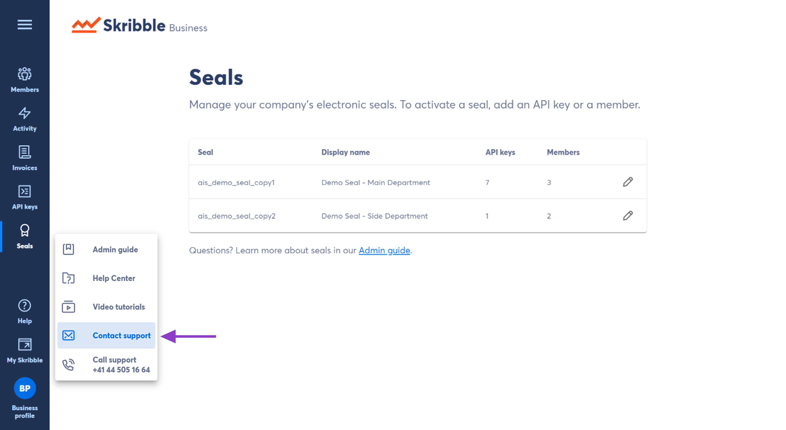

.. _inhouse-support:

============================================================
Adding an In-House Support Contact (First-Level Support) 🆕
============================================================

.. NOTE::
  Enterprise customers can add a dedicated in-house support contact for their members.

As an admin, you can add an e-mail address and a phone number that your Skribble Business members can contact if they need help. This is a great way to streamline your organization's support and enable your members to contact their trusted support team.

To add in-house support as the primary support contact:

- Click **Business profile** in the lower left

- Go to **In-house support** and click on the pencil icon

- Add an **e-mail address and a phone number**

- Click **Save** to confirm 

.. NOTE::
  Be aware that your members will see this contact in the help section of their Skribble profile.

**Need help with your member's question?**

- Contact our support team by clicking on **Contact support** in your **Business profile**

