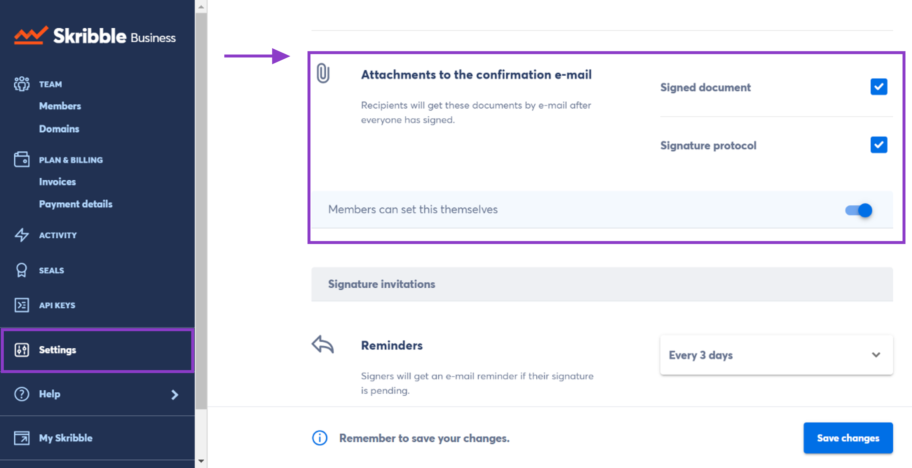

.. _signature-protocol:

==================
Signature Protocol
==================

.. NOTE::
   Signature protocols are available to Skribble Enterprise customers. You can have them sent by e-mail to all recipients after everyone has signed.

**What is a signature protocol?**

Think of a signature protocol as a history of all recipients' activities. Need to know who viewed or signed the document with which e-signature standard or who declined to sign? Instead of checking each document in your account, your members can download the signature protocol as a PDF and archive it with the signed copy. This way, the compliance team or other stakeholders can easily access this information.

**Attaching signature protocols to the confirmation e-mail**

As an admin, you can decide if protocols of signed documents should be sent by e-mail to all recipients after everyone has signed. You can also let your team members decide. Depending on your settings, they'll see a checkbox when setting up a signature invitation. Here's how it works:

- From your Skribble Business, click **Settings** on the left 

-  Go to **Attachments to the confirmation e-mail**

- Check the box next to **Signed document**, **Signature protocol** or both

- If you want to let your members decide, slide the switch to the right. They'll see a checkbox when setting up a signature invitation, and can decide for each document if any attachments should be sent.

    

**Here’s how your members can download a signature protocol:**

- Go to **Documents** and open the document you want
- Click on the **3 dots** at the top-right
- Click on **Signature protocol** to download it
- **Alternative:** Click on the **tooltip i** at the top-right of the document. Then select an **icon** that looks like a document and says **Signature protocol** when you hover over it.
- Open the downloaded signature protocol, and file it with the signed copy of a document if you need

**Understanding signature protocol**

The information in the protocol depends on whether a signature invitation was created on our platform or directly from your tools, the e-signature standard used, and other things. The following information should help you understand signature protocols:

- **Document title**
- **Signature invitation ID**
- **Number of signatures**
- **Document and signature invitation status**
      • Open – some signatures are still pending
      • Signed – all recipients finished signing the document
      • Declined – one of the recipients declined to sign the document
      • Withdrawn – the person who sent the invitation has withdrawn it
      
- **Participants and their details**

Participants are all recipients of a signature invitation, including observers who aren't signing themselves and API users. You'll see their name, e-mail address, phone number, user ID, and business they belong to

- **Activity details** (such as date, time, and IP address)

You'll see when a document, signature or signature protocol was: created, viewed, updated, signed, assigned, declined, withdrawn, or downloaded.

- **Observers**

Added or removed observers of a signature invitation

- **Visual signature**

If your company uses electronic seals, you'll see their visual representation in the protocol instead of a visual signature.

- **Signature ID**

- **E-signature standard used**
      • Simple electronic signature (SES)
      • Advanced electronic signature (AES)
      • Qualified electronic signature (QES)
      
- **Legislation**
      • eIDAS for European law
      • ZertES for Swiss law
      
- **Digital certificate details**

This includes certificate subject, issuer, and serial number.
