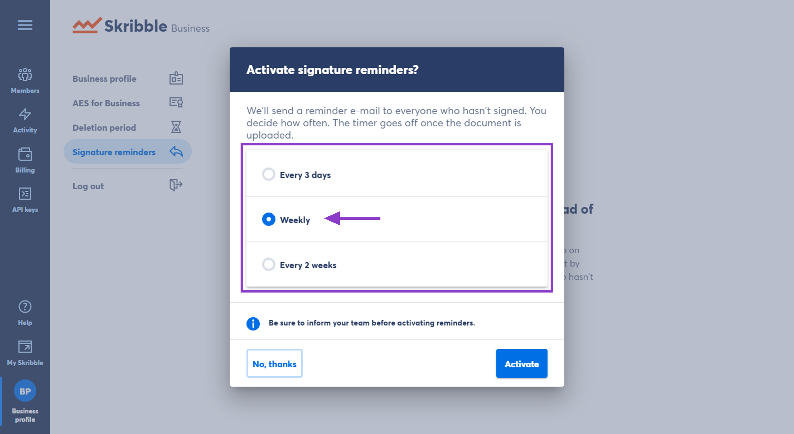

.. _signature-reminders:

==============================
Activating Signature Reminders
==============================

Your team no longer needs to follow up on pending signatures manually. Instead, you can `activate signature reminders`_, and we’ll send an e-mail to everyone who hasn’t signed. Be sure to inform your team if you decide to activate reminders for them.
  
.. _activate signature reminders: https://my.skribble.com/business/profile/signature-reminders
  
.. NOTE::
  The timer goes off the day the signature invitation is sent.
  
To activate signature reminders for your Skribble Business members:

- Click **Business profile** in the lower-left

- Go to **Signature reminders** and click **Get started**

- Choose **how often** reminders should be sent and click **Activate** to confirm

    

**Example:** Let’s say you want to send signature reminders weekly, and the signature invitation is sent on Monday the 1st. Here is how reminders are sent:

•	**1st reminder** is sent on Monday the 8th
•	**2nd reminder** is sent on Monday the 15th
•	**3rd reminder** is sent on Monday the 22nd, and so on.

.. NOTE::
  Is there a `document deletion period`_ set for your team? Keep in mind that we’ll send no reminders for deleted documents. Let’s say the deletion period is 5 days. If you choose to send signature reminders every 3 days, we’ll only send 1 reminder.
  
.. _document deletion period: https://my.skribble.com/business/profile/deletion-period
  
