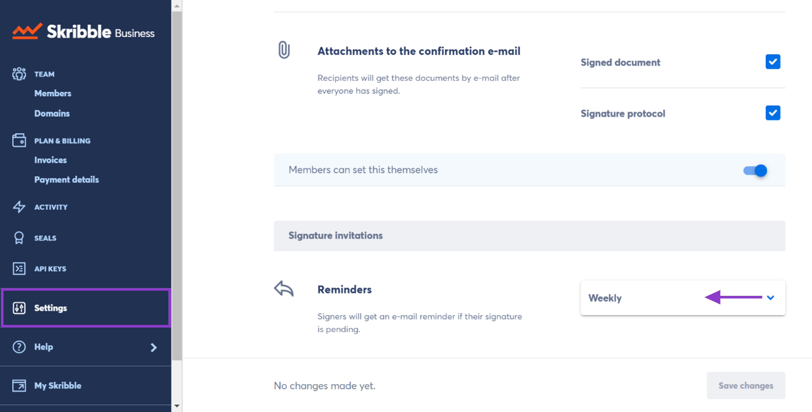

.. _signature-reminders:

===================
Signature Reminders
===================

Your team no longer needs to follow up on pending signatures manually. Instead, you can set `signature reminders`_, and we’ll send an e-mail to everyone who hasn’t signed. Be sure to inform your team before doing so.
  
.. _signature reminders: https://my.skribble.com/business/profile/
  
.. NOTE::
  We start counting on the day your team members send the signature invitation.
  
Here's how you can set how often reminders should be sent:

- From your Skribble Business, click **Settings** and go to **Reminders**

- Choose **how often** reminders should be sent and click **Save changes** to confirm

    

**Example:** Let’s say you want signature reminders to be sent once a week. Here is how it works if the signature invitation is sent on Monday the 1st:

•	**1st reminder** is sent on Monday the 8th
•	**2nd reminder** is sent on Monday the 15th
•	**3rd reminder** is sent on Monday the 22nd, and so on.

.. NOTE::
  Is there a `document deletion period`_ set for your team? Keep in mind that we’ll send no reminders for deleted documents. Let’s say the deletion period is 5 days. If you choose to send signature reminders every 3 days, we’ll only send 1 reminder.
  
.. _document deletion period: https://my.skribble.com/business/profile/
  
