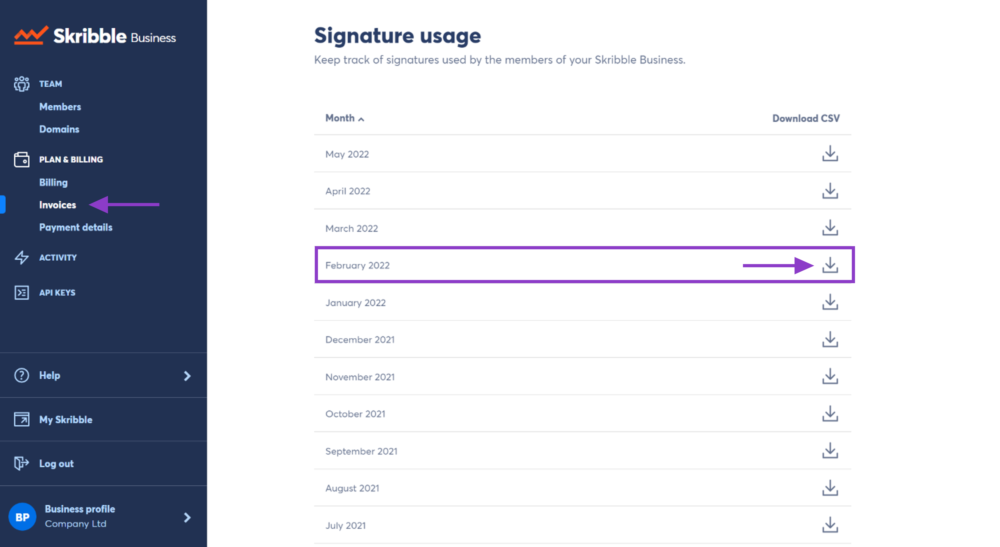
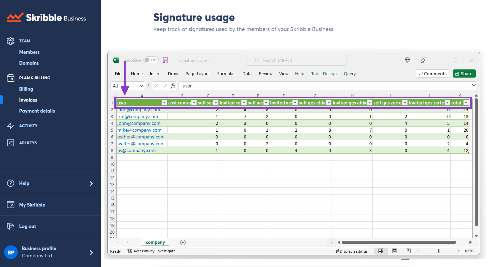

.. _account-signatureusage:

========================
Tracking Signature Usage
========================
  
As an admin, you can download a monthly signature usage report as CSV for more cost transparency. In addition, signature reports help keep track of signatures made by your Skribble Business members and people they invite to sign.
  
.. NOTE::
  Signature reports show all Skribble Business members regardless of whether they've signed or not.
  
To download the report:

- Click **Invoices** on the left in the menu

- Then go to **Signature usage**

- Click the **Download icon** on the right of a calendar month (the CSV will be downloaded to your computer)

- Open the CSV document (feel free to convert it to the format that suits you best)

**Understanding the signature report**

The CSV document will contain the following information:
  - **User** – member's e-mail address, including members who sign directly from OneDrive, Google Drive or SharePoint
  - **Cost center** – cost center within your organisation (available on request to Business and Enterprise customers with an active single sign-on). If not specified, this column will be left empty.
  - **Self SES, AES and QES** – number of signatures made by your members, where eIDAS stands for EU law and ZertES for Swiss law
  - **Invited SES, AES and QES** – number of signatures made by people invited to sign by your members, where eIDAS stands for EU law and ZertES for Swiss law
  - **Total** – number of signatures made by your members and people they've invited to sign

.. NOTE::
  Would you like to assign a cost center to a member of your business and display it in a CSV? Get in touch with our team at support@skribble.com. We'll be happy to help.
  
