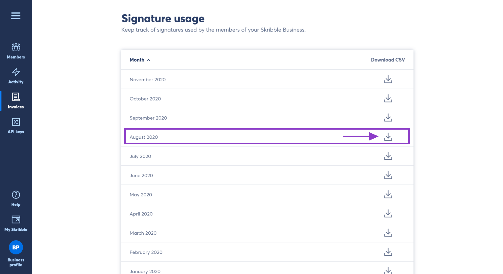

.. _account-signatureusage:

==================================
Downloading Signature Usage Report
==================================
  
As an admin, you can download a monthly signature usage report as CSV for more cost transparency. Signature reports help keep track of signatures used by your members.
  
.. NOTE::
  Signature reports will show all Skribble Business members regardless of whether they've signed or not.
  
To download the report:

- Click **Invoices** from your Business profile

- Navigate to **Signature usage**

- Click the **Download icon** on the right of a calendar month (the CSV will be downloaded to your computer)

- Open the CSV document

**Understanding the signature report**

The CSV document will contain the following information:
  - **User** – member's e-mail address or an API
  - **Cost centre** –  cost centre within your organisation (available only to Skribble Enterprise customers with an active single sign-on). If not specified, this column will be left empty.
  - **Self SES, AES and QES** – number of signatures made by members
  - **Invited SES, AES and QES** – number of signatures made by people who were invited to sign by your Skribble Business members

.. NOTE::
  Would you like to assign a cost centre to a member of your business and display it in a CSV? Please contact our team at support@skribble.com. We will be happy to help.
  
