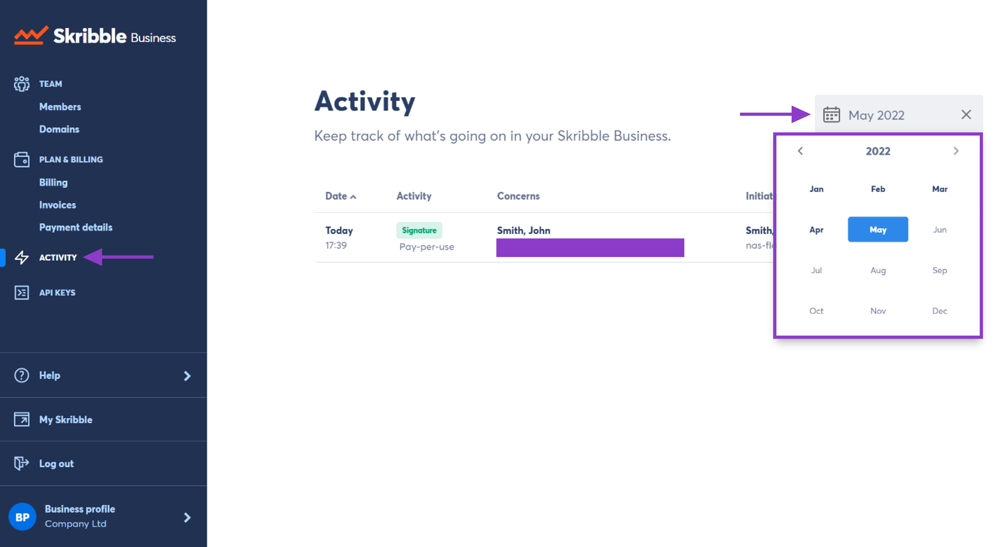

.. _monitor-account:

===================
Monitoring Activity
===================

Need to know who of your members was made or removed as admin or who signed a document? On the activity overview page, you can track what's going on in your Skribble Business.

.. NOTE::
  You'll see all activity during the current calendar month. Click the calendar icon to select the month you want.

-  Click **Activity** on the left in the menu

-  Click the **calendar icon** to select the month you want

    

- To see all activity since setting up your Skribble Business, click the **X** next to the month/year

You can sort the information by:
  - Date
  - Activity
  - Member concerned
  - Initiated by

- Clicking on any of these will sort the rows by that information
