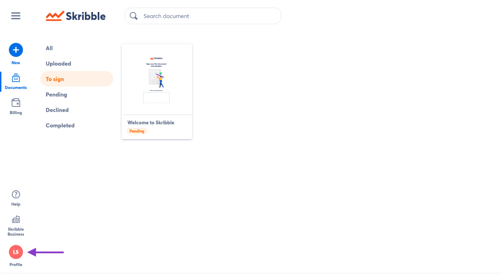
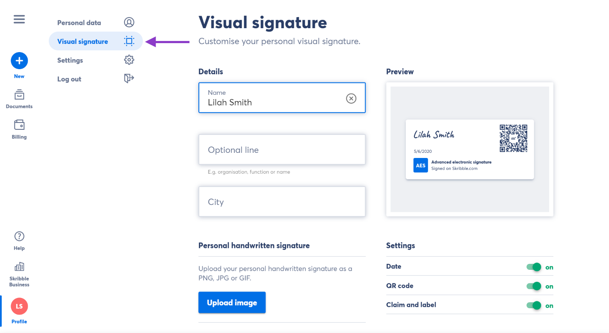
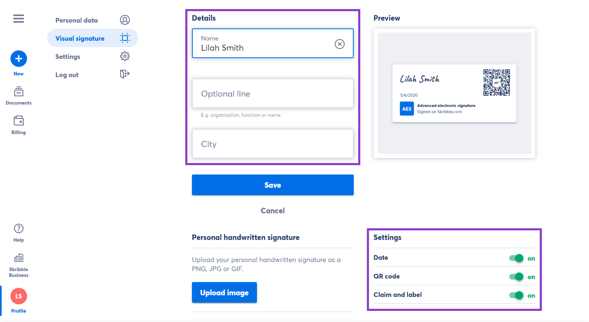
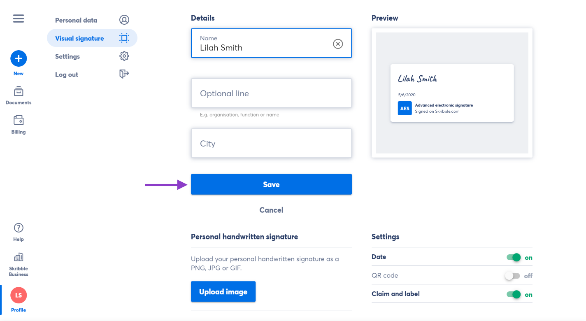

.. _account-visualsignature:

=================================
Customising Visual Signatures 🆕
================================= 

.. NOTE::
  Skribble Enterprise customers can set a uniform visual signature for all employees to ensure a consistent look and feel across the company. Contact us at info@skribble.com for more information.
   
Visual signatures serve as an optional element and don’t affect the legal weight of the electronic signature. It is up to members to decide whether they want to add the visual signature to a document next to the electronic signature.

**A step-by-step guide for your members to customise their visual signature:**

- Click **Profile** in the lower-left

- Go to **Visual signature**

From here, you can customise the following details:
  - **Name**: Your first and last name
  - **Optional line** and **City**: Optional lines for extra information (e.g. organisation, function or name)
  - **Date**: The date when the document was signed  
  - **QR code**: Leads to the `website`_ that explains the e-signature standards
  - **Claim and label**: "Signed with Skribble.com" claim along with an icon of the e-signature standard used
  
  
   .. _website: https://www.skribble.com/signaturestandards/
   
   

    
    
- Update the information you want to be displayed on your visual signature and click **Save** to confirm

Not sure how to create your personal visual signature? Have a look at our `Help Center`_.
  
   .. _Help Center: https://help.skribble.com/-en-creating-visual-signature
   

.. NOTE::
   If any of these customisation options are not available to you, your current plan might not support it. Please contact our support team at support@skribble.com.
