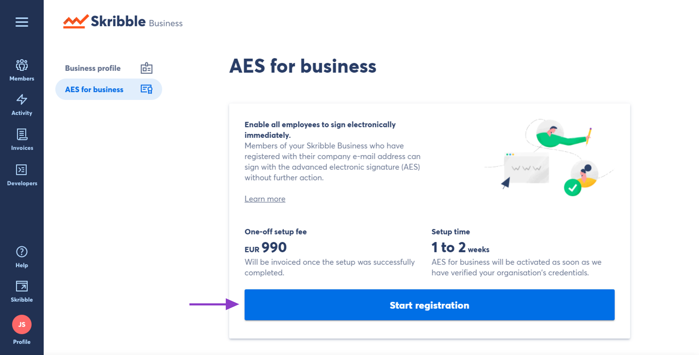

.. _aes-setup:

===========================
Setting up AES for Business
===========================

.. NOTE::
  Please be aware that AES for Business setup may take up to 4-6 weeks. For more pricing information, visit our `Pricing page`_.

.. _Pricing page: https://www.skribble.com/en/pricing/
  
With AES for Business, your company domain (e.g. yourcompany.com) enables signing with the advanced electronic signature (AES). Anyone who creates a new Skribble account using your company domain (e.g. jsmith@yourcompany.com) can sign with AES without further action.

To set up AES for Business for your company, we'll need the following information:
  - Company domain (e.g. yourcompany.com)
  - Commercial register number of your company
  - Name and e-mail address of an internal contact person

To request AES for Business:

- Click **Business profile** in the lower left

- Go to **AES for Business** and click **Start registration**

- You'll be taken to a form to provide your company details

- Once you submit the form, the AES for Business registration will start
