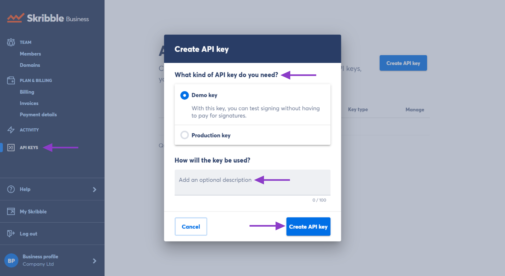
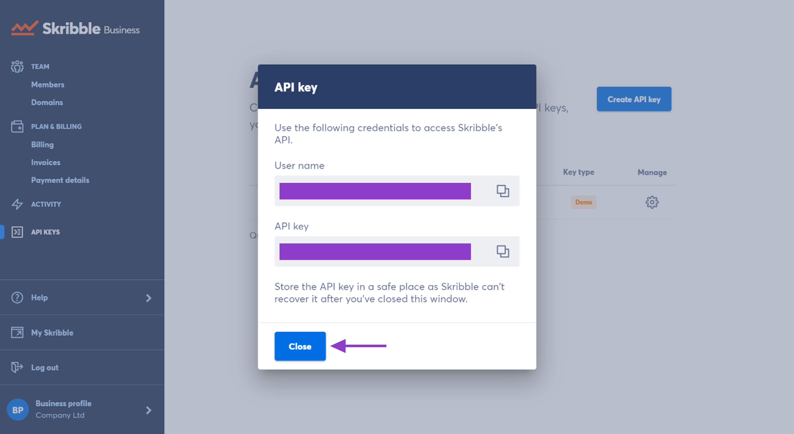
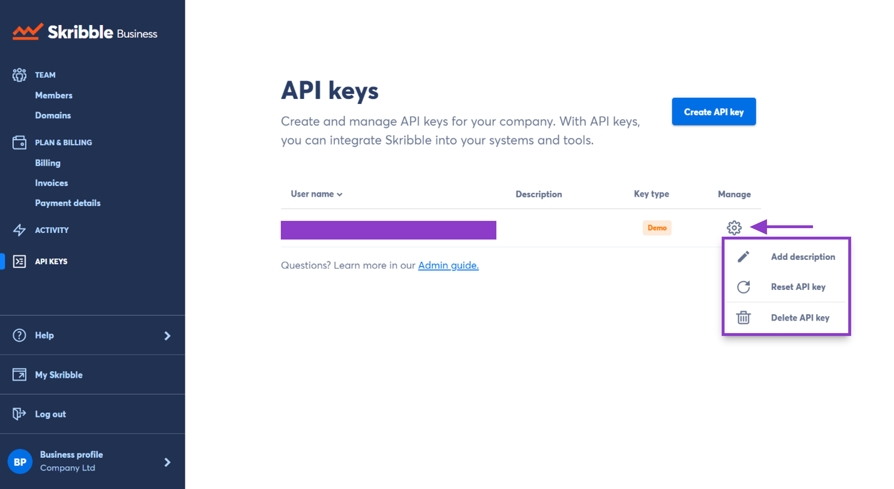

.. _api-create:

==============================
Creating and Managing API Keys
==============================

Skribble integrates with your existing tools, such as OneDrive, SharePoint, Google Drive or your industry solution. Once integrated, your team members can sign and get documents signed from their favourite tools. They can also invite external stakeholders to sign documents without creating a Skribble account.   

For more information on integrating Skribble, please visit our `API documentation`_.

  .. _API documentation: https://api-doc.skribble.com/
  
As an admin, you can generate and manage API keys for your company.
  
Creating an API key
-------------------

- Click **Skribble Business** in the lower-loft 

- Go to **API keys** and click **Create API key** at the top right

- You can choose between 2 types of keys:

    •	**Demo API keys** are for testing and development purposes. Signatures requested by such keys don't have any legal weight and are free of charge. The signing process works without 2FA.

    •	**Production API keys** are used for live systems. Signatures requested by such keys will be invoiced. All costs of signature requests created with your API key will be charged to your company.

- Select the API key you need

- Add an optional description, such as how the key is used or by which department

    

- You can view the API key (your password) and your username in the next step

- Be sure to store your password safely. Unfortunately, we won’t be able to recover it after you close the window.

Managing API keys
-----------------

You can add an API key description and reset or delete an API key. To do so:

- Go to **API keys**

- Click the gearwheel icon on the right of the key, and a window with 3 options will open:

    •	**Add description**: A short and meaningful description works best if your company has several API keys in use. When adding a description, think of what the key is used for or what tool. **Example:** Testing OneDrive integration

    •	**Reset API key**: Resetting is irreversible and will disable all the existing integrations with this key until the new API key is in place. Clicking **Reset API key** will generate a new key.

    •	**Delete API key**: Deleting will remove all existing integrations irreversibly.

Need help with generating or managing your API keys? Drop us an e-mail at `support@skribble.com`_. 

  .. _support@skribble.com: support@skribble.com
