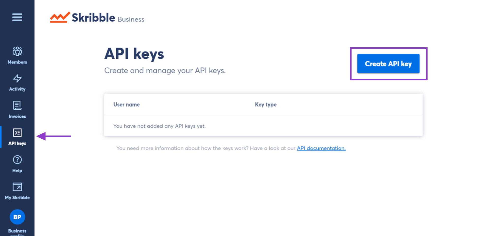
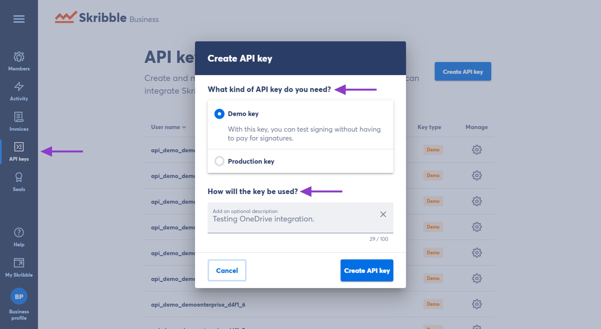
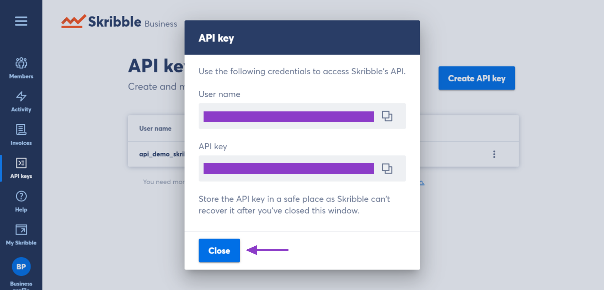
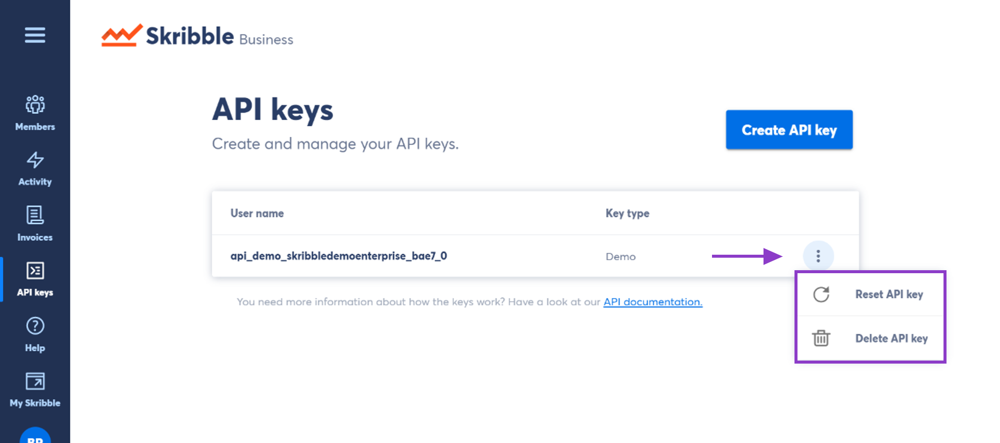

.. _api-create:

==============================
Creating and Managing API Keys
==============================

Skribble integrates with your existing tools, such as OneDrive, SharePoint, Google Drive or your industry solution via API. With the API connection, your team members can sign and get documents signed from the systems they already use. They can also invite external stakeholders or contracting parties to sign documents without having to creating a Skribble account. 

As an admin, you can generate and manage API keys for your company.  

For more information on integrating Skribble, please visit our `API documentation`_.

  .. _API documentation: https://api-doc.skribble.com/
  
  
Creating an API key
-------------------

- From your Business profile, go to **API keys** and click **Create API key** at the top right

You can choose between 2 types of keys:
  - **Demo API keys** are for testing and development purposes. Signatures requested by such keys don't have any legal weight and are free of charge. The signing process works without 2FA.
  - **Production API keys** are used for live systems. Signatures requested by such keys will be invoiced. All costs of signature requests created with your API key will be charged to your company. 

- Select the key you need

- Add an API key description (optional)

If your company has several API keys in use, a short and meaningful description will work best. Think of what the keys is being used for or for what tool, when adding a description. Example: Testing OneDrive integration

In the next step, you can view the API key (this is your password) along with your username.

.. NOTE::
  The API key is your password and should be stored in a safe place. Skribble won't be able to recover it after you've closed the window.

Resetting or deleting an API key
--------------------------------

To reset or delete an API key:

- Go to **API keys**

- Clicking the three vertical dots next to the API key will open a window with two options:

  - **Resetting the API key** is irreversible and will disable all the existing integrations with this key until the new API key is in place. Clicking **Reset API key** will generate a new key.
  - **Deleting the API key** will remove all existing integrations irreversibly.

Need help with generating or managing your API keys? Drop us an e-mail at `support@skribble.com`_.  

  .. _support@skribble.com: support@skribble.com
