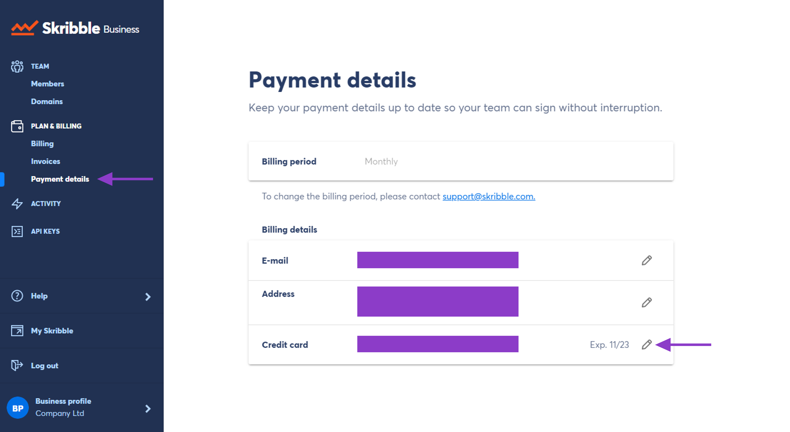

.. _billing-payment-method:

=======================
Updating Payment Method
=======================

When setting up Skribble Business for your company, you can choose between a credit card or SEPA Direct Debit as a payment method. We won't charge it during the free 30-day trial so that you can get started with no strings attached.

.. NOTE::
  If you want to pay by invoice after the free trial, get in touch with our support team at support@skribble.com. However, we only recommend this if you plan to use Skribble long-term, as switching to invoices is done manually.

To update your payment method:

- Click **Skribble Business** in the lower left 

- Go to **Payment details** under **Plan & Billing**

- Click the **pencil icon** next to your payment method to update it

.. NOTE::
  If you're paying by invoice, please keep in mind that you won't be able to see your credit card information even if you entered it in the past.

   

    

- Choose if you want to pay by **credit card** or **SEPA Direct Debit**

- For the correct billing, make sure that your payment method is **valid**

- Then click **Update** to save changes

