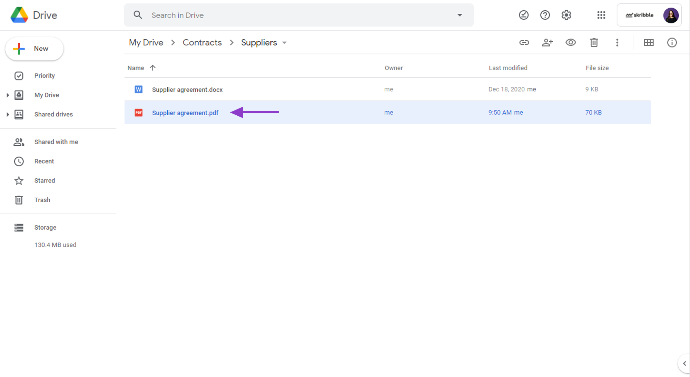
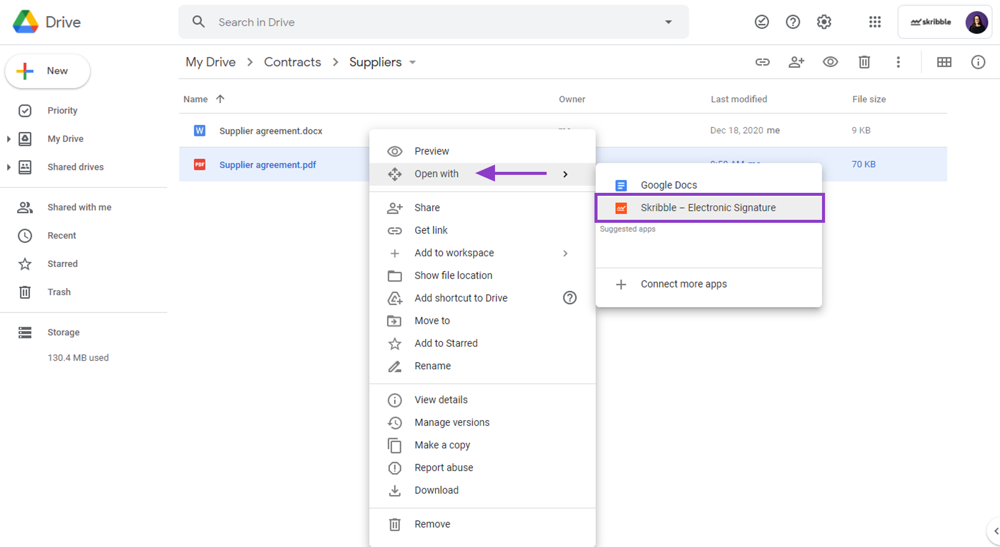
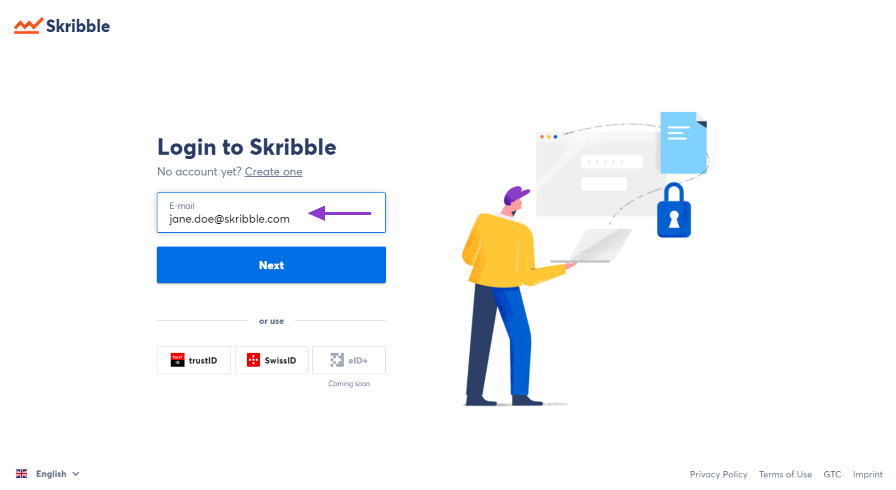
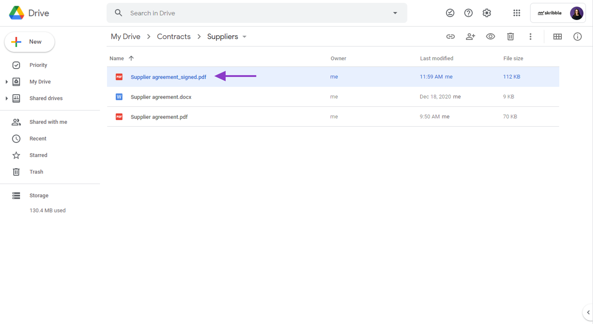

.. _sign-google-drive:

=============================
How to sign from Google Drive
=============================

.. NOTE::
  Signing from Google Drive is only available to Skribble Business customers.
  
Has your Google Drive admin connected your company's Skribble Business with Google Drive? Then you can sign with Skribble from your Google Drive Web App.

To sign a document from Google Drive (video tutorial available `here`_):

.. _here: https://youtu.be/zKqAU9ke46I

- Go to **Google Drive Web App** at `drive.google.com/drive`_ (not the local version on your computer)

.. _drive.google.com/drive: https://drive.google.com/drive

- **Right-click** on the document you want to sign

    

- Click **Open with** and select **Skribble Electronic Signature** from the list

You don't see Skribble Electronic Signature after right-clicking on the document? Please contact your Google Drive admin.

    

- **Log in** with your **Skribble account** and sign the document or invite others to sign the usual way

Your Skribble and Google Drive e-mail address must match.

    
    
- After all invited parties have signed the document, the signed copy will be saved next to the original document in your Google Drive

    
 
You can't find the signed document next to the original document? Check the folder **Signed with Skribble Electronic Signature**. This is where we'll save signed documents if you don't have access rights to the folder where the document is when the last signature is made.
    
