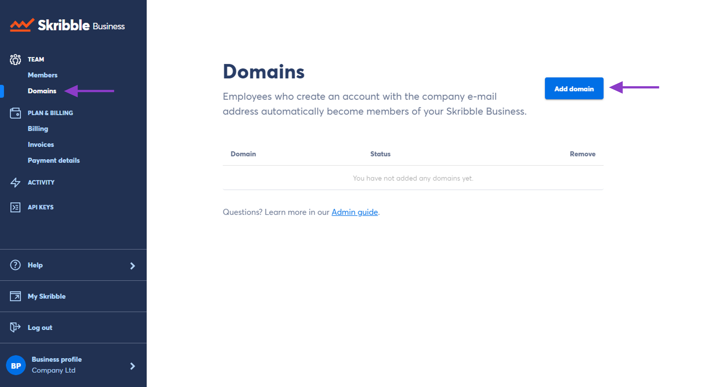

.. _adding-members:

==============
Adding Members
==============

There are two ways to add members to your Skribble Business:

- By domain 
- By e-mail

The simplest way to add members is by registering your company domain (@company.com) with Skribble. Employees who create a **new Skribble account** using your company domain will automatically become your Skribble Business members.

.. NOTE::
  If an employee created a Skribble account *before* the domain was registered, you'll need to add them to your Skribble Business by e-mail. Please see *Adding members by e-mail*, described below.
  
Adding members by domain
-------------------------

- Click **Domains** on the left in the menu

- Then click **Add domain**

- Enter the domain and click **Add**

We'll activate your domain once we've checked that it belongs to your company. You'll find the current status of the added domain next to its name:

  •	**Activated** — your domain is active
  •	**Requested** — Requested — we’ll check your domain manually, which can take up to 48 hours
  
We'll inform you by e-mail once it's done.
  
Questions or need a hand? Contact our support team at `support@skribble.com`_.  

  .. _support@skribble.com: support@skribble.com
  

Adding members by e-mail
-------------------------

The other way to add members to your Skribble Business is by e-mail:

.. NOTE::
   The person must already have a Skribble account before they can be added to your Skribble Business.

- Go to **Members**

- Click **Add Member**

- Enter the e-mail address and click **Add**

To add several e-mails at once, separate them with a comma. 

If the recipient has a Skribble account, they're now added to your Skribble Business.
