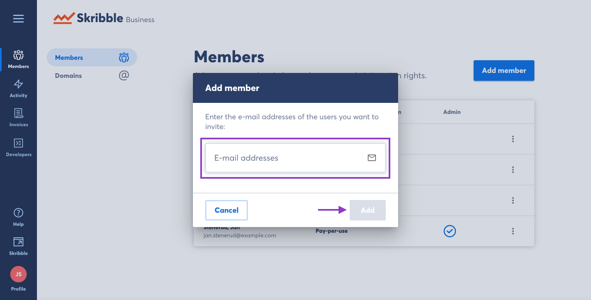

.. _adding-members:

========================================
Adding Members to your Skribble Business
========================================

There are two ways to add members to your Skribble Business:

- By domain 
- By e-mail

The simplest way to add members to your Skribble Business is by registering your company domain (@example.org) with Skribble. Once done, anyone who creates a **new** Skribble account using your company domain will become a member of your Skribble Business.

.. NOTE::
  Employees of your company who created a Skribble account *before* you registered the domain will not be added automatically to your account. You will need to add them by e-mail. Please see Adding members by e-mail, described below.
  
Adding members by domain
-------------------------

- Click **Members** if you aren't already there

.. image:: adding_members.png
    :class: with-shadow

- Click **Domains**

.. image:: adding_home.png
    :class: with-shadow

- Click **Add domain**

.. image:: adding_domains.png
    :class: with-shadow

- Enter the domain and click **Add**

We'll activate the domain once we've checked that it belongs to your company. Usually, it happens immediately. In some cases, we'll need to check the domain manually. This can take up to 48 hours.

.. image:: adding_add.png
    :class: with-shadow

- After adding a domain, you'll see its status next to the domain name:

  •	**Activated** — your domain has been activated
  •	**Requested** — we'll check the domain manually and inform you once it's done (this can take up to 48 hours)
  •	**Declined** — we couldn't activate the domain because it's invalid or already taken

.. image:: adding_requested.png
    :class: with-shadow

Questions or need a hand? Contact our support team at `support@skribble.com`_.  

  .. _support@skribble.com: support@skribble.com
  

Adding members by e-mail
-------------------------

The other way to add members to your Skribble Business is by e-mail:

.. NOTE::
   The person must already have a Skribble account before they can be added to your Skribble Business.

- Click **Members** if you aren't already there

.. image:: adding_members.png
    :class: with-shadow

- Click **Add Member**

.. image:: adding_email.png
    :class: with-shadow

- Type the e-mail address of the person you wish to add to your Skribble Business. To add several e-mails at once, separate them with a comma. Once you're finished adding e-mails to the text box, click **Add**.

If the recipient has a Skribble account, they're now added to your Skribble Business.
