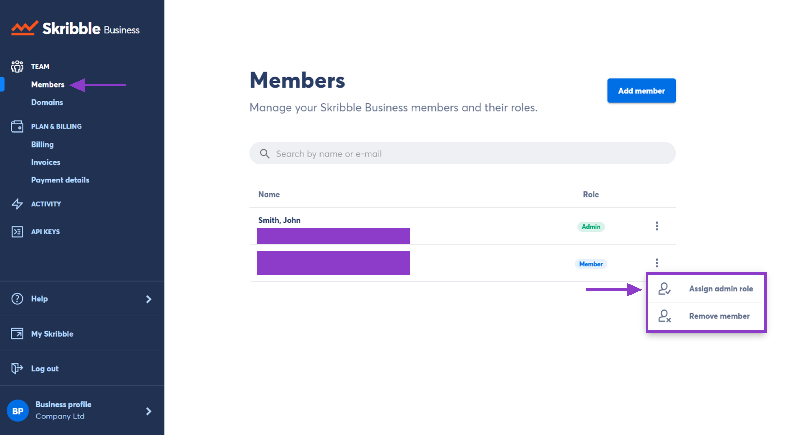

.. _adding-admins:

===================
Granting Admin Role
===================

On the Members page in your Skribble Business, you can view and manage your members. To make someone an admin:

- Go to **Members** at the top-left 

- Click the **3 vertical dots** to the right of the member

- Click **Assign admin role**

This member will now have access to admin functions such as adding and removing members, monitoring the activity of other members, and granting or revoking the admin role.

