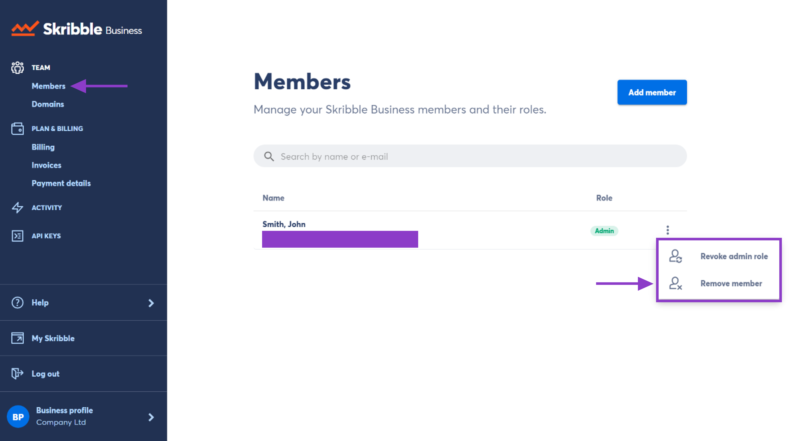

.. _removing-members:

================
Removing Members
================

.. NOTE::
   Removing a member from Skribble Business will put them on the free plan
   
On the Members page in your Skribble Business, you can view and manage your members and admins. 

To remove a member:

- Go to **Members** and click the **3 vertical dots** to the right of the member

- Click **Remove member** 

