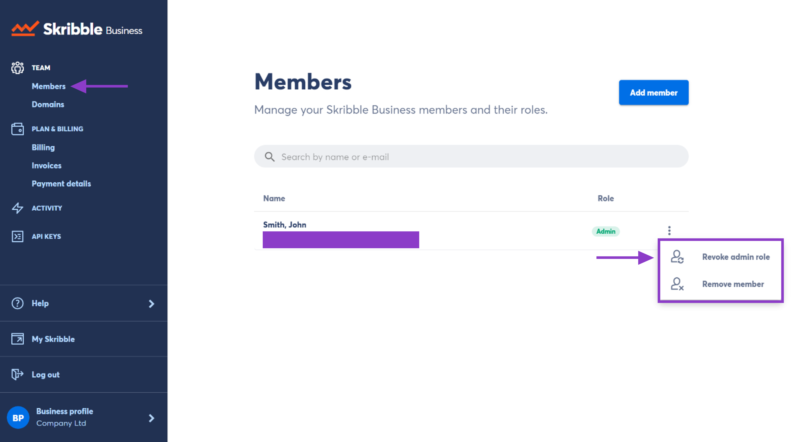

.. _revoke-admin:

===================
Revoking Admin Role
===================

.. NOTE::
  If you're the only admin, you'll first need to make someone else an admin before you can remove yourself as an admin.

- Go to **Members** if you aren't already there

- Click the **3 vertical dots** to the right of the member

- Click **Revoke admin role**

This user will still be a member of your Skribble Business, but will no longer have access to admin functions.

