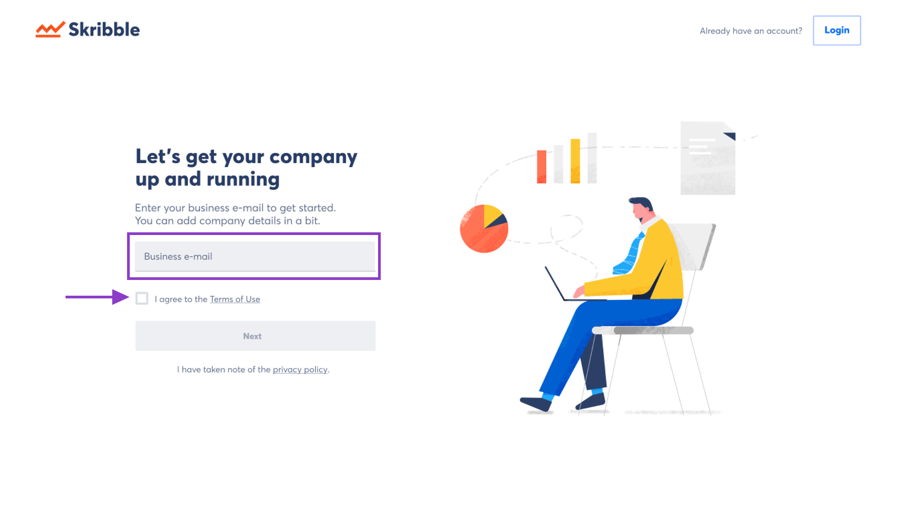
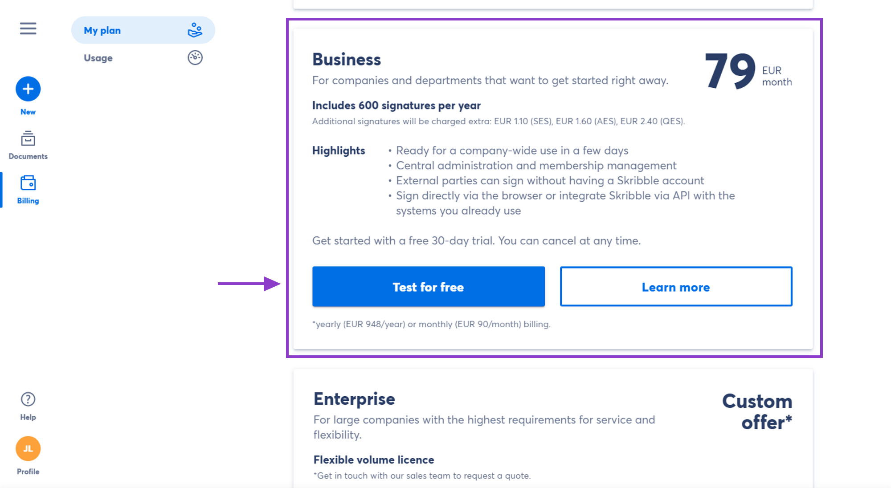

.. _upgrade-to-business:

============================
Setting up Skribble Business
============================

.. NOTE::
 Whether you already have a Skribble account or not, there are 2 ways to set up Skribble for your company and start a free 30-day trial. Read on to find out how it works.

Skribble offers a free trial month to new Business customers. You won't be charged during the trial period, and you can cancel at any time.

New to Skribble? This is how it works.
--------------------------------------

Setting up Skribble Business for your company will make you the admin. Don't worry, you can add more admins later if you need.

- Go to `my.skribble.com/business/signup`_

.. _my.skribble.com/business/signup: my.skribble.com/business/signup

- Enter your **business e-mail address** and read our **Terms of Use**

- Check the box and click **Next** if you agree with the terms

We'll send you a confirmation link by e-mail to make sure we got your e-mail right.

- Go to the e-mail and **follow the link** to **confirm your e-mail address**

- Can't find the e-mail? Check your spam folder. If you didn't get it, check the spelling of your e-mail address before you click **Resend e-mail.**

- After confirming your e-mail address, set a **password** for your account.

**To set up Skribble for your company, we'll need a few more details.**

- Enter the exact **company name**, **your first** and **last name** and read our **General Terms & Conditions**

- Check the box and click **Next** if you agree with the terms

- Enter your **company’s billing address** and click **Next**

- Choose your preferred **billing period** (monthly or yearly) for payments after the trial

- Enter your **credit card details** and click **Start your free 30-day trial**

**Note:** Your credit card won't be charged until the 30-day trial period expires. We need your card details for future payments after the trial period.

Congratulations, you can now test Skribble Business for free for 30 days. What's next? To get the most out of your trial, add your team members and make sure they give Skribble a go. 

Already have an account? This is how it works.
----------------------------------------------

If you already use Skribble with your **business email address**, you can set up Skribble Business for your company directly from your Skribble account. This will make you the admin. Don't worry, you can add more admins later if you need.

- Click **Billing** on the left in your Skribble account

- Navigate to **Skribble Business** and click **Test for free**

    

- Enter the exact **company name** and read our **General Terms & Conditions**

- Check the box and click **Next** if you agree with the terms

- Enter your **company's billing address** and click **Next**

- Choose your preferred **billing period** (monthly or yearly) for payments after the trial

- Enter your **credit card details** and click **Start your free 30-day trial**

**Note:** Your credit card won't be charged until the 30-day trial period expires. We need your card details for future payments after the trial period.

Congratulations, you can now test Skribble Business for free for 30 days. What's next? To get the most out of your trial, add your team members and make sure they give Skribble a go. 

