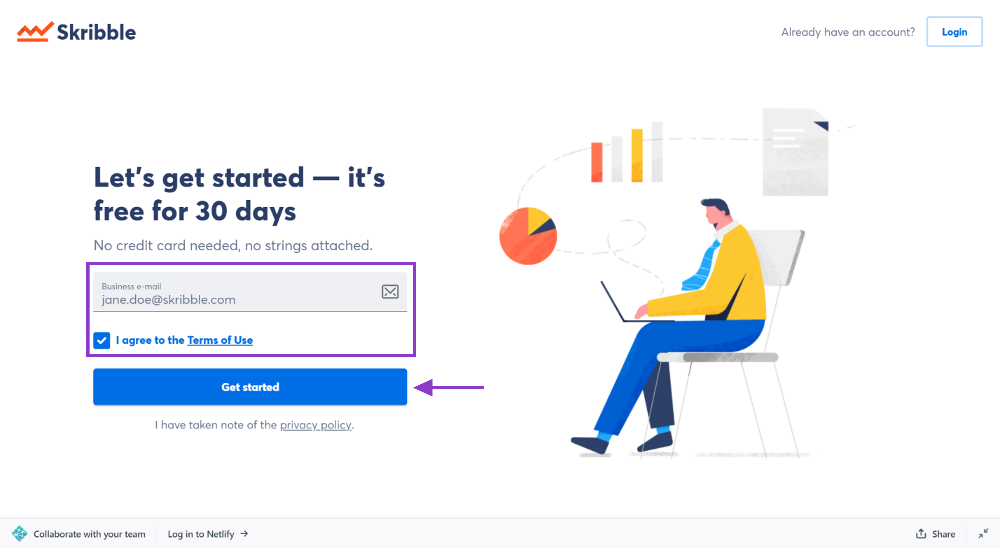

.. _upgrade-to-business:

============================
Setting up Skribble Business
============================

.. NOTE::
 Whether you already have a Skribble account or not, there are two ways you can set up Skribble for your company and start a free 30-day trial. Read on to find out how it works.

Skribble offers a free trial month to new Business customers. You won't be charged during the trial period, and you can cancel at any time.

New to Skribble? This is how it works.
--------------------------------------

Setting up Skribble Business for your company will make you the admin. You can add more admins later if you need.

- Go to `my.skribble.com/business/signup`_

.. _my.skribble.com/business/signup: https://my.skribble.com/business/signup/

- Enter your **business e-mail address** and read our **Terms of Use**

- Check the box and click **Get started** if you agree with the terms

We'll send you an e-mail to check that we got your e-mail address right.

- Open this e-mail and **confirm your e-mail address**

- Can't find the e-mail? Check your spam folder. If you didn't get it, check the spelling of your e-mail address before you click **Resend e-mail.**

- After confirming your e-mail address, set a **password** for your account.

**To set up Skribble for your company, we'll need a few more details.**

- Enter the exact **company name**, **your first** and **last name** and read our **General Terms & Conditions**

- Check the box and click **Start your free trial** if you agree with the terms

Congratulations, you can now test Skribble Business for free for 30 days. What's next? To get the most out of your trial, add your team members and make sure they give Skribble a go.

Already have an account? This is how it works.
----------------------------------------------

If you already have a Skribble account with your **business e-mail address**, you can set up Skribble Business for your company directly from your account. This will make you the admin. You can add more admins later if you need.

- Click **My plan** and go to **Plan details**

- Navigate to **Business** plan, then click **Test for free**

- Enter the exact **Company name** and read our **General Terms & Conditions**

- If you agree with the terms, check the box and click **Start your free trial**

Congratulations, you can now test Skribble Business for free for 30 days. What's next? To get the most out of your trial, add your team members and make sure they give Skribble a go.

Upgrading to the paid plan
--------------------------

.. NOTE::
 By adding your payment details, such as billing period, billing address, and payment method, you automatically upgrade to the paid plan. We won't charge your payment method until your 30-day trial ends.
 
 To upgrade to the paid plan from your Skribble Business:

- Click **Upgrade** in the box on the right or go directly to **Payment details**

- Choose your preferred billing period (monthly or yearly)

- Add your billing address, including a valid VAT number if applicable

- Choose your preferred payment method – credit card or SEPA Direct Debit

SEPA Direct Debit is a common payment method in the EU. The abbreviation SEPA stands for Single Euro Payments Area.

- That's it! After adding your payment details, your Skribble Business will continue to run automatically after your free trial ends.

